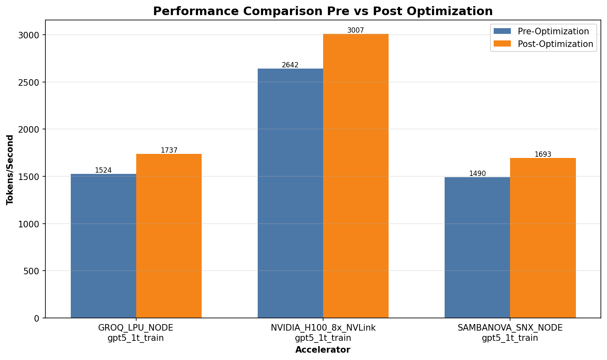

# Atlas Fabric: Data-Driven Benchmarking for LLM Infrastructure

Sizing and pricing an LLM deployment rarely has a single correct answer. There is a wide range of hardware options, evolving workloads, meaningful latency objectives, and finite budgets. Atlas Fabric provides a practical, data-driven way to compare accelerators, tune configurations, and evaluate trade-offs before committing resources.

Modern LLMs stress every layer of the stack: sequence length, memory bandwidth, interconnects, and power. Teams choosing among H100, Groq LPU, and SambaNova systems (and emerging options) need more than marketing collateral—they need a reliable way to pose "what if?" questions and obtain grounded answers.

Atlas Fabric enables this by simulating throughput, latency, cost, and power across hardware and workloads. You can run preconfigured scenarios or define your own via YAML. Most importantly, you can calibrate the model to your hardware so that the results reflect your environment.

This is not a vendor-driven benchmark. It is a transparent model that you can inspect, calibrate, and adapt to your environment.

---

## The model framework

The model has a simple backbone:

- How fast the hardware could be in theory
- How efficiently we’re actually using it (utilization)
- How much performance we lose to talking across devices (communication)

In words: performance equals theoretical capability multiplied by achieved utilization, divided by inter-device communication overhead.

Atlas Fabric is a semi-empirical model: the structure follows first principles, while the important coefficients are measured on real systems. Theory defines the curve; measurement sets the constants.

A more complete derivation of the equations and simulation flow is documented in [model_equations.md](./model_equations.md).

A few practical implications:
- 100% utilization is not assumed. Production workloads typically observe 40–60% without targeted optimization.
- Communication is not free. Tensor and pipeline parallelism provide memory headroom, with synchronization costs.
- Tail latency matters. P95/P99 often drive SLAs, so tail multipliers and queueing are modeled explicitly.

---

## Initial assumptions — validate and calibrate via design of experiments

Initial assumptions:

- Hardware
  - Base utilization around ~0.55, capped near ~0.90 with tuning.
  - HBM bandwidth typically 40–80% of peak, rising with sequence length.
  - Network fabrics differ: InfiniBand is our baseline; RoCE/virtual NICs add overhead and jitter.
- Workloads
  - Training uses homogeneous sequence lengths; dataloaders are not the bottleneck (defaults to synthetic data).
  - Inference assumes reasonable batching and that KV cache fits in memory.
  - Arrival processes for inference can be non-Poisson; queue delays are bounded to avoid unrealistic spikes.
- Optimization knobs
  - CUDA Graphs typically add approximately 10–12% utilization.
  - GPUDirect RDMA often helps by ~5% and reduces communication penalties.
  - Defaults for trillion-parameter scale are TP=8, PP=8, DP=16 (adjust as needed).
- Noise and uncertainty
  - A small, seeded jitter is injected so runs are realistic and reproducible.
  - Not all failure modes are simulated (thermal throttling, retries, etc.)—note these separately if they apply.

All of these are configurable in YAML. Calibrate these parameters for best accuracy.

---

## Calibration: adapt the model to your environment

The default configuration provides useful results; calibration yields reliable results.

For detailed measurement procedures, validation steps, and common pitfalls, see [model_calibration.md](./model_calibration.md).

Recommended workflow (short version):

1. Measure single-accelerator performance
- Determine `B_base` (tokens/sec per accelerator) using a clean, single-GPU benchmark across sequence lengths and batch sizes.
- Estimate `rho_base` (base utilization) by comparing observed to theoretical FLOPs.

2. Profile communication
- Increase tensor and pipeline parallelism; observe how throughput scales.
- Fit coefficients for incremental communication overhead per TP/PP step.
- Compare fabrics (InfiniBand vs. RoCE vs. cloud vNIC) to quantify penalties.

3. Characterize latency
- Establish a minimum floor and a scaling coefficient for p50 service time.
- Collect sufficient samples under load to compute realistic P95/P99 multipliers.
- Incorporate queueing when building schedules.

4. Fit the power curve
- Measure idle and maximum node power.
- Fit a linear relationship from utilization to watts. Use it to compute energy consumption and cost per 1,000 tokens.

5. Validate and keep it current
- Cross-validate on workloads that were not used for calibration.
- Watch for drift (new drivers, firmware, or environmental changes). Recalibrate when errors increase.

---

## What you can do

Atlas Fabric benchmarks and compares LLM infrastructure options across training and inference. It supports multiple accelerators, configurable workloads, automatic optimization, and rich reports.

**Key capabilities:**
- Run head-to-head comparisons of accelerators for training workloads
- Explore latency and cost trade-offs for production inference with realistic traffic
- Optimize key parameters (batching, parallelism, CUDA Graphs, GPUDirect) with simple acceptance rules
- Generate reports with charts that support clear team discussion

**Features:**
- Multi-accelerator profiles: NVIDIA, Groq, SambaNova (extend via YAML)
- Key metrics: throughput, latency, cost, power
- Auto-optimization: tunes performance versus cost trade-offs
- Visualizations: performance charts, cost breakdowns, utilization maps
- Demo mode: pre-configured benchmark scenarios
- Reports: HTML and Markdown outputs with analysis

## Quick Start

```bash
# Install
pip install -r requirements.txt

# Run demo scenarios (training + inference)
python demo.py

# Or run a specific target/workload
python -m atlas_fabric.cli run \
  --targets workload/targets.yaml --target NVIDIA_H100_8x_NVLink \
  --workloads workload/workloads.yaml --workload gpt5_1t_inference \
  --track parity --hardware accelerators --seed 1337 --out out

# Optimize the configuration
python -m atlas_fabric.cli optimize \
  --record out/last_run.json --sla 100.0 --out out

# Generate a report
python -m atlas_fabric.cli report --records out --out out/report.md
```

---

## Architecture

High-level system overview:

```
┌─────────────────────────────────────────────────────┐
│                 User Interface                      │
│        (CLI / Interactive Demo / Web UI)            │
└────────────────────────┬────────────────────────────┘
                         │
┌────────────────────────▼────────────────────────────┐
│                    Core Engine                      │
│  ┌──────────────┐  ┌────────────┐  ┌──────────────┐ │
│  │ LLM Workload │  │ Accelerator│  │   Runtime    │ │
│  │     Specs    │  │    Specs   │  │    Tuning    │ │
│  └──────────────┘  └────────────┘  └──────────────┘ │
└────────────────────────┬────────────────────────────┘
                         │
┌────────────────────────▼────────────────────────────┐
│                  Simulation Engine                  │
│  - Performance Model                                │
│  - Cost Calculator                                  │
│  - Power Estimator                                  │
└────────────────────────┬────────────────────────────┘
                         │
┌────────────────────────▼────────────────────────────┐
│               Analysis & Reporting                  │
│  - Optimizer           - Visualizer                 │
│  - Reporter            - Exporter                   │
└─────────────────────────────────────────────────────┘
```

---

## Usage Examples

### Training large models

```bash
# GPT-5 scale training example
python -m atlas_fabric.cli run \
  --targets workload/targets.yaml \
  --target NVIDIA_H100_8x_NVLink \
  --workloads workload/workloads.yaml \
  --workload gpt5_1t_train \
  --track parity \
  --hardware accelerators \
  --seed 1337 \
  --out results
```

Key settings for `gpt5_1t_train`:
- Sequence length: 32k tokens
- Parallelism: `tp:8`, `pp:8`, `dp:16` (1024-way total)
- Precision: FP8 weights, BF16 activations

### Demo scenarios

Run pre-configured benchmarks:

```bash
python demo.py
```

This runs default scenarios and saves reports to `out/demo_*/`:
- `gpt5_1t_training`: training throughput and cost across accelerators
- `gpt5_1t_inference`: inference capacity and latency under various traffic loads

Example output from recent runs:
- Training results: `out/demo_20251007_123832_training/`
- Inference results: `out/demo_20251007_123845_inference/`

To add custom scenarios:
1. Define workloads in `workload/workloads.yaml`
2. Add targets in `workload/targets.yaml`
3. Update `demo.py` or use the CLI directly

---

## Configuration

### Custom workload definition

```yaml
# my_workload.yaml
- name: custom_model
  framework: pytorch
  model_family: transformer
  params:
    hidden_size: 8192
    n_layers: 64
    vocab_size: 50000
  parallelism:
    tp: 4  # Tensor parallel
    pp: 2  # Pipeline parallel
    dp: 2  # Data parallel
  sequence:
    prompt: 4096
    generate: 1024
  precision:
    weights: fp16
    activations: fp16
  dataloader: synthetic
  duration_minutes: 10
  track: parity
```

### Custom target definition

```yaml
# my_target.yaml
- name: CUSTOM_ACCELERATOR
  vendor: CustomVendor
  instance_type: CA.X1
  accelerators_per_node: 8
  num_nodes: 1
  memory_gb_per_accel: 128
  interconnect:
    type: CustomLink
    bw_GBps: 1200
  host_cpu_arch: x86
  numeric: [bf16, fp16, int8]
  collectives: [allreduce, allgather]
  max_batch_tokens: 65536
  container_base: custom:latest
  cost:
    hourly_usd: 120.0
    energy_watts_node: 4000
    pue: 1.2
```

---

## Sample output

The simulator generates JSON data and Markdown reports. Example visualizations from recent runs:

- Training comparison — throughput and cost across accelerators


- Inference latency — latency distribution with queueing effects


## Documentation

For detailed information about the simulator:

- [model_equations.md](./model_equations.md) — Mathematical model and formulas (semi-empirical)
- [model_calibration.md](./model_calibration.md) — How to measure and calibrate model parameters  
- [workload_authoring.md](./workload_authoring.md) — How to create custom workloads